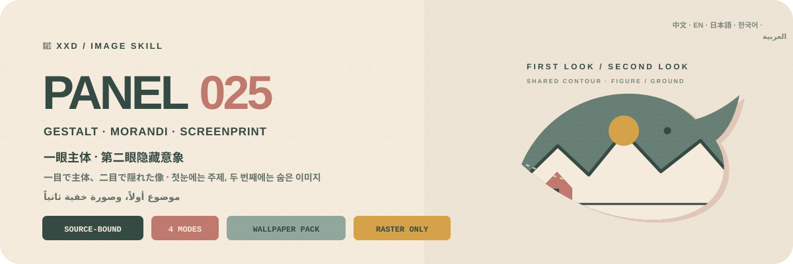
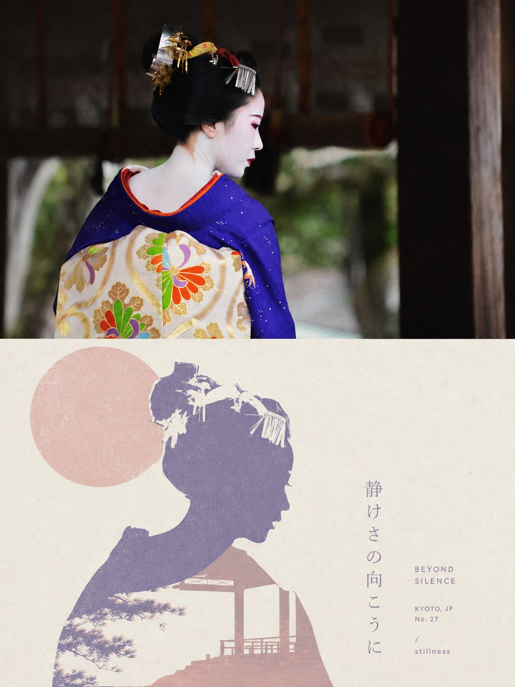
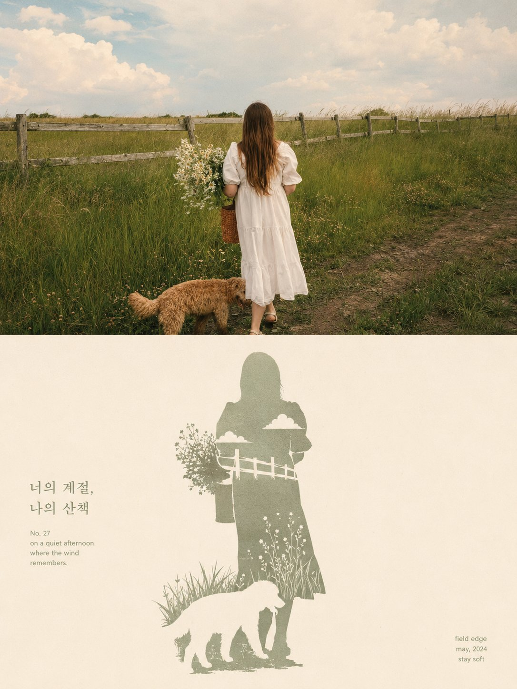
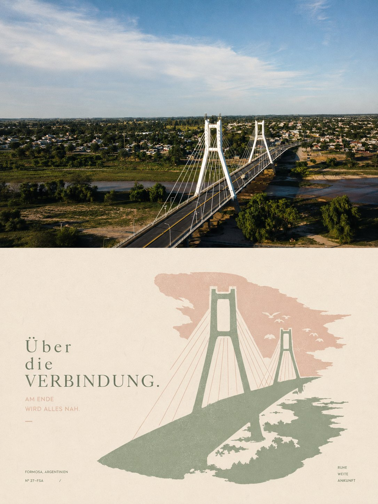
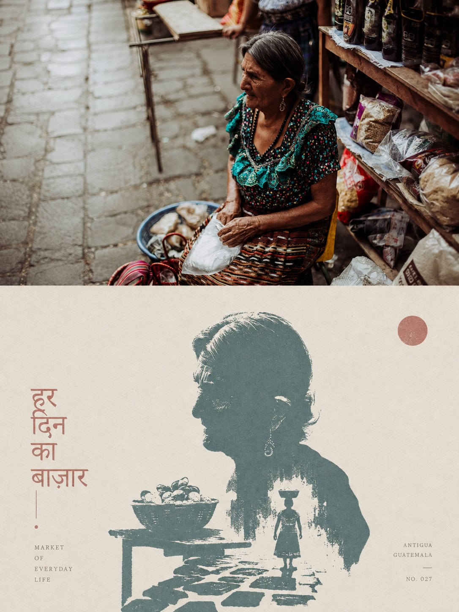

<p align="center">
  
</p>

<div align="center">

# 🦁 XXD Panel 025

### Turn a photograph into a first-glance subject and second-glance hidden-image Gestalt screenprint

[](./SKILL.md)
[](#four-outputs-one-double-reading-logic)
[](#boundaries-and-trust)

<a href="README.md">简体中文</a> · <strong>English</strong> · <a href="README.ja.md">日本語</a> · <a href="README.ko.md">한국어</a> · <a href="README.ar.md">العربية</a>

</div>

> FIRST-GLANCE SUBJECT · SECOND-GLANCE IMAGE · FIGURE–GROUND REVERSAL · 2–4 MORANDI COLOURS · PHYSICAL SCREENPRINT

XXD Panel 025 is an image-generation Skill for Codex and compatible agents. It locks one clear, recognisable silhouette from the photograph, then selects one closely grounded environment, structure, object, or symbolic image from that same source. Contour interlock, negative-space cutout, shared boundary, and figure–ground reversal unite them into one visual anchor: the subject reads first; the hidden image emerges second.

Generous pale paper and two to four airy, source-derived Morandi colours keep the image calm and legible. Shapes are flat and edges crisp, with only slight paper fibre, screenprint grain, ink coverage, and registration shift. There are no gradients, digital blur, realistic shadows, 3D effects, or excessive distress. Type enters through contour, negative boundary, baseline, or whitespace axis and participates in the second reading.

## Why it exists

A generic “double exposure” poster often leaves two objects side by side or transparently overlaid, while a generic “vintage screenprint” becomes little more than old paper, noise, and a fixed palette.

025 reverses that logic:

```text
lock the source subject → extract a recognisable silhouette → choose one source-grounded hidden image → make contours and negative space truly interlock → establish first- and second-glance hierarchy → derive 2–4 Morandi colour shapes → add restrained physical print evidence → embed type into the shared boundary
```

If an unrelated photograph could replace the source without materially changing the principal silhouette, hidden image, shared contour, composite colour temperature, or copy, the result is not 025.

## The 025 visual contract

- **Subject reads first:** at least three source-specific cues preserve identity, contour, pose, action, and relation, even at thumbnail size.
- **Hidden image reads second:** choose exactly one source-grounded environment, structure, object, or symbol that rewards closer viewing.
- **One inseparable graphic:** use contour interlock, negative-space cutout, shared boundary, and figure–ground reversal; never side-by-side objects, transparency overlays, or ordinary double exposure.
- **One visual anchor:** both readings share a single compositional centre while generous pale paper creates room for discovery.
- **Two to four Morandi colours:** derive a low-saturation but living palette from the source; keep shapes flat, crisp, and airy.
- **Physical print evidence:** retain slight paper fibre, screenprint grain, ink coverage, and registration shift without excessive distress.
- **Intelligent type intervention:** a very short title and sparse microtype enter contour, negative boundary, baseline, or whitespace axis and deepen the same meaning.

## Samples · From X

> [Xiaoxiaodong (@xiaoxiaodong01)](https://x.com/xiaoxiaodong01/status/2090423630320779424) · 2026-08-20<br>
> GPT2 x 剪影 x 融合 x 格式塔 x 美学提示词 x VOL.025

<table>
  <tr>
    <td width="50%"><a href="https://x.com/xiaoxiaodong01/status/2090423630320779424"></a></td>
    <td width="50%"><a href="https://x.com/xiaoxiaodong01/status/2090423630320779424"></a></td>
  </tr>
  <tr>
    <td width="50%"><a href="https://x.com/xiaoxiaodong01/status/2090423630320779424"></a></td>
    <td width="50%"><a href="https://x.com/xiaoxiaodong01/status/2090423630320779424"></a></td>
  </tr>
</table>

<p align="center"><a href="https://x.com/xiaoxiaodong01/status/2090423630320779424">View the original post and full prompt →</a></p>

These samples demonstrate the 025 aesthetic motive. Their subjects, composition, palette, copy, and earlier canvas ratio never become generation references or current defaults.

## The original brief is authoritative

`references/025-source.md` is this project's sole creative and aesthetic authority. The Skill no longer summarizes or expands it, and it does not impose a shared palette, colour plan, aesthetic motive, title, or microcopy package. GPT Image 2 follows that brief's own rules for colour, material, composition, whitespace, wording, and typography.

Mode and size change only the legacy 3:4 top-bottom container. In left-right mode, the brief's upper photo and lower design map to the left and right. In design-only and wallpaper modes, the lower design language expands across the whole canvas. Every other source-brief instruction remains active.

## Four combinable output modes

Select one or more of `top-bottom`, `left-right`, `design-only`, and `wallpaper-pack`. Paired work is generated as one complete canvas by default; deterministic composition is only a fallback after a failed retry, for pixel-identical source preservation, or for lossless size calibration.

Ordinary sizes are also multi-select: auto-fit, source aspect, 1:1, 3:4, 4:3, 4:5, 5:4, 2:3, 3:2, 9:16, 16:9, 21:9, 5:7, 7:5, or custom ratios/exact pixels. There is no silent default. Every distinct aspect is independently recomposed from the same verbatim source brief.

Wallpaper packs may be linked or independent. A linked pack creates one anchor image, then recomposes each remaining device from the original source plus that anchor; it never crops one image into four sizes.

## Text modes

Before generation, resolve one of three choices:

1. **Model generates text from the original prompt**: the user supplies only the language or locale; GPT Image 2 follows the source brief's own wording, amount, tone, and typography logic.
2. **Use my exact text**: pass it verbatim, without rewriting, translating, or adding a title; typography still follows the source brief.
3. **No text**: prohibit visible text and pseudo-text.

The outer Skill no longer pre-writes titles, microcopy, or copy packages. Output language is resolved separately from the interface language and is never guessed from a person, scene, or filename.

## Complete-canvas first, raster-only delivery

The image model owns the aesthetics of the entire finished composition; paired layouts also default to one complete-canvas generation. `scripts/compose_panel.py` remains only for condition-based recovery, lossless pixel calibration, and read-only audit. It is not run pre-emptively and does not judge aesthetic success.

Every deliverable is a raster PNG and every invocation creates a fresh task under `~/Desktop/xxd/`. The configured image route exposes sanitised status only—never providers, endpoints, credentials, headers, prompts, responses, or account details. SVG, HTML, Canvas, diagrams, and programmatic drawing are not substitutes for the final artwork.

## Capability-adaptive questions and inline parameters

The same Skill adapts to the host's real interaction capabilities and never presents decorative symbols as clickable controls:

- **When Claude Code exposes `AskUserQuestion + multiSelect: true`**: modes and sizes use genuine checkboxes; text mode and wallpaper relationship use single-select. Common sizes are grouped into square, portrait, and landscape checkbox questions, selections accumulate across groups, and custom sizes use free input.
- **When Codex exposes only `request_user_input`**: use it only for mutually exclusive fields such as text mode and wallpaper relationship. Do not misrepresent modes or sizes as single-choice; collect them through clear combination input.
- **With no interactive question tool**: use two typed rounds—modes first, then sizes plus text. Never draw fake `- [ ]` boxes or ask the user to switch to Plan mode merely to obtain a form.

The second round initially shows only Smart recommendation, Source aspect, Common ratios, and Custom. Expand the full library only when requested: square `1:1`; portrait `3:4, 4:5, 2:3, 9:16, 5:7`; landscape `4:3, 5:4, 3:2, 16:9, 21:9, 7:5`. Any ratios may be combined, and exact pixels are always accepted.

All settings can also be passed inline:

```text
/xxd-panel-025 photo.jpg --mode top-bottom,design-only --size auto,3:4,9:16 --text prompt --locale ja-JP
```

Supported parameters are `--mode`, repeatable or comma-separated `--size`, `--text prompt|exact|none`, `--locale`, `--copy`, `--wallpaper linked|independent`, `--wallpaper-size`, and `--out`. Complete parameters skip preflight; partial parameters trigger only missing questions.

## Image-model priority

GPT Image 2 is the default first choice. It keeps this project's established workflow: high-fidelity source reference, explicit whole-canvas selection before generation, one complete-canvas generation for paired modes, and scripted composition only as a conditional fallback.

Seedance 5.0 Pro, Nano Banana Pro (Gemini Image Pro), Nano Banana 2 (Gemini Image Flash), or another compatible bitmap model may also be used when it is actually available through the current tools or configured routes and can satisfy source fidelity, whole-canvas ratio, target-language text, and linked-wallpaper multi-reference requirements. An alternative changes only the generation route; it must not change modes, canvas, copy, locale, wallpaper relationship, or the complete-canvas-first strategy.

If no suitable route is available, the Skill asks the user to enable an image-generation tool or provide an API key. User-provided credentials may be used for the current task without being echoed, displayed, logged, or exposed. They are not persisted, and provider, account, billing, or global route configuration is not modified, unless the user explicitly requests that configuration change.

## Get started

```bash
git clone https://github.com/nevertoday/xxd-panel-025.git
mkdir -p ~/.codex/skills
ln -s "$(pwd)/xxd-panel-025" ~/.codex/skills/xxd-panel-025
```

Claude Code users may link the same directory to `~/.claude/skills/xxd-panel-025`. Restart the agent session after installation.

```text
$xxd-panel-025
Turn this photograph into a left-right composition. Derive the copy from the image and write it in natural Korean.
```

You may invoke the Skill with only a photograph. It first asks for one or more modes in a numbered multiline menu, then for copy settings; wallpaper mode also asks for linked/independent continuity and device sizes.

Full specifications:

- [Skill workflow](SKILL.md)
- [Chinese runtime adapter](references/xxd-panel-025-prompt.zh-CN.md)
- [English runtime adapter](references/xxd-panel-025-prompt.en.md)
- [Original style brief](references/025-source.md)

## Boundaries and trust

- Each photograph stays within its own task and never borrows subjects, colours, copy, or composition from other inputs, old results, or samples.
- Every invocation creates a fresh task directory; even identical sources and parameters must generate anew.
- Deliverables are PNG bitmaps, never SVG, HTML, Canvas, or programmatic-drawing substitutes.
- The configured bitmap bridge emits sanitised status only and does not expose providers, endpoints, headers, credentials, prompts, or response bodies.
- Each selected ordinary mode returns one file; selected `wallpaper-pack` adds four separate wallpapers. `all` returns seven PNGs per source across four sibling mode directories, never a contact sheet or overview.

Local composition needs Python 3 and Pillow. The safe bitmap bridge uses Python 3.11+ `tomllib`. Image generation still requires a host agent with built-in raster generation or an already configured compatible raster route.

## Repository

```text
xxd-panel-025/
├── SKILL.md
├── README.md / README.en.md / README.ja.md / README.ko.md / README.ar.md
├── agents/openai.yaml
├── assets/
│   ├── banner.svg
│   └── examples/ (reserved for future local samples)
├── scripts/
│   ├── compose_panel.py
│   └── configured_imagegen.py
└── references/
    ├── xxd-panel-025-prompt.zh-CN.md
    ├── xxd-panel-025-prompt.en.md
    └── 025-source.md
```

## About XXD

XXD is the abbreviated brand name of Xiaoxiaodong. This project is created and maintained by [@xiaoxiaodong01](https://x.com/xiaoxiaodong01).

## Support and Membership

### In-depth Consultation · CNY 299/hour

One-to-one consultation for using the Skills is billed at CNY 299 per hour. Contact Xiaoxiaodong through the WeChat QR code below to book.

### Xiaoxiaodong Skills User Community · CNY 99 to join

A one-time CNY 99 fee joins the community for workflow sharing, work discussion, and peer support. It does not include hourly one-to-one consultation. Include “Skills User Community” in your WeChat message.

### Knowledge Planet + Member Prompt Library · CNY 699/year

[Knowledge Planet](https://wx.zsxq.com/group/15554814142882) and the [XXD Member Prompt Library](https://vip.xiaoxiaodong.ai/) are one membership: **one annual payment unlocks both, with no second purchase required.**

1. Subscribe through [Knowledge Planet](https://wx.zsxq.com/group/15554814142882), then contact Xiaoxiaodong on WeChat for a Prompt Library redemption code.
2. Subscribe through the [Member Prompt Library](https://vip.xiaoxiaodong.ai/), then contact Xiaoxiaodong on WeChat for a Knowledge Planet invitation.

<p align="center">
  <a href="https://xiaoxiaodong.pages.dev/assets/wechat-qr.png"></a>
</p>

<div align="center">

**Recognise it at first glance; understand it at second glance.**

</div>

---

<div align="center">
  <h2>☕ Support this open-source project</h2>
  <p>If this project saved you time, a Star, a share, or a coffee helps keep it moving.</p>
  <table>
    <tr>
      <td align="center" width="240">
        <a href="https://github.com/nevertoday/zhongguo-traditional-colors/blob/main/docs/images/buy-me-a-coffee-qr.png?raw=true"></a><br>
        <strong>Buy me a coffee</strong><br>
        <sub>Scan or open the QR code to support Xiaoxiaodong</sub>
      </td>
    </tr>
  </table>
  <p><sub>Support is entirely optional and never changes access to this open-source project.</sub></p>
</div>
